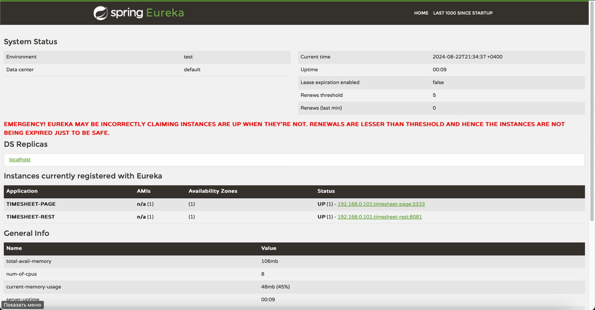

### Домашнее задание:
1. Повторить код с урока
2. Запустить Eureka, Запустить 2 части (rest + page)
3. В качестве результата работы прислать 1 скриншот со страницы localhost:8761,
   где видно оба запущенных приложения (Instances currently registered with Eureka)

